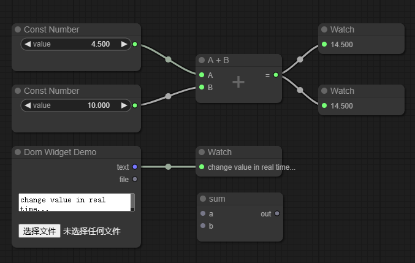

# litegraph.ts

> This project is an experimental port and refactor of litegraph.js (based on [litegraph.ts](https://github.com/space-nuko/litegraph.ts)) to TypeScript with ESM module support.

**litegraph.ts** is a TypeScript library designed to create graphs in the browser, akin to Unreal Blueprints. Users can easily program nodes, and the library includes an editor for constructing and testing graphs.

- Seamless integration with existing web applications
- Capability to run graphs independently of the editor
- Extensive [documentation](https://lenml.github.io/litegraph.ts/) available



> **Note:** The API and serialization format are not entirely compatible with vanilla litegraph.js and may change during development.

> **Note 2:** This project's primary objective is to publish litegraph.ts to npm while carrying out ongoing renovations and refactoring.


## Features
- Renders on Canvas2D (zoom in/out and panning, easy to render complex interfaces, can be used inside a WebGLTexture)
- Easy to use editor (searchbox, keyboard shortcuts, multiple selection, context menu, ...)
- Optimized to support hundreds of nodes per graph (on editor but also on execution)
- Customizable theme (colors, shapes, background)
- Callbacks to personalize every action/drawing/event of nodes
- Subgraphs (nodes that contain graphs themselves)
- Live mode system (hides the graph but calls nodes to render whatever they want, useful to create UIs)
- Graphs can be executed in NodeJS
- Highly customizable nodes (color, shape, slots vertical or horizontal, widgets, custom rendering)
- Easy to integrate in any JS application (one single file, no dependencies)
- Typescript support

> The above are the features of litegraph.js, which this library fully inherits. Below are the new features continuously updated in this library.
>
> (A checkmark indicates implemented features)

- [x] DOMWidget: Internally implemented widgets that support DOM, making it easy to create various UIs
- [ ] ReactWidget: Integrate support for using React components as widgets, allowing for more dynamic and complex UIs within nodes
- [ ] Getter Setter Node: Implement getter and setter nodes that determine node connections in a hidden form
- [ ] Event Bus: LGraph / LGraphCanvas / LGraphNode support event subscription, making it easy to customize various features
- [ ] Customize ContextMenu: Provide interfaces to customize all context menus in the graph
- [ ] Customize Dialog: Provide interfaces to customize all dialogs in the graph
- [ ] Graph Scheduler: Provide graph connection parsing based on graph theory, decompose component, and control different component(sub-graphs)
- [ ] Core Code `strictNullChecks`: Type safe everywhere!
- [ ] Input/Output widget: Provide widgets for easier handling of input and output within nodes.
- [ ] Control Flow: Introduce nodes that manage control flow like conditional branches and loops.
- [ ] UI testing

## Installation

```
npm install @litegraph-ts/core @litegraph-ts/nodes-basic
```

## Example Usage

``` typescript
import { LiteGraph, LGraph, LGraphCanvas } from "@litegraph-ts/core"
import { ConstantNumber, Watch } from "@litegraph-ts/nodes-basic"

// Include litegraph's CSS, required for the UI to function properly
import "@litegraph-ts/core/css/litegraph.css"

// Grab canvas element from the index.html
const root = document.getElementById("main") as HTMLDivElement;
const canvas = root.querySelector<HTMLCanvasElement>(".graphCanvas");

// Setup graph (nodes/logic) and graph canvas (rendering/canvas/UI)
const graph = new LGraph();
const graphCanvas = new LGraphCanvas(canvas, graph);
graphCanvas.background_image = "imgs/grid.png";
(window as any).graph = graph;
(window as any).graphCanvas = graphCanvas;

// Refresh graph on every draw tick in a loop
graph.onAfterExecute = () => {
    graphCanvas.draw(true);
};

// Create a ConstantNumber, sends a constant number on its output
var constNumber = LiteGraph.createNode(ConstantNumber);
constNumber.pos = [200, 200];
constNumber.setValue(4.5);

// Create a Watch, displays input value on its panel
var watch = LiteGraph.createNode(Watch);
watch.pos = [600, 300];

// Add components to the graph
graph.add(constNumber);
graph.add(watch);

// Connect the first output of the number (output 0) to the first input of the watch (input 0)
constNumber.connect(0, watch, 0);

// Begin executing logic on the graph
graph.start();
```

# How to code a new node?

```ts
export class SumNode extends LGraphNode {
  static slotLayout: SlotLayout = {
    inputs: [
      {
        type: "number",
        name: "num_a",
      },
      {
        type: "number",
        name: "num_b",
      },
    ],
    outputs: [
        {
            type: 'number',
            name: 'sum'
        }
    ]
  };

  override onExecute(param: any, options: object): void {
    const input0 = this.getInputData(0) ?? 0;
    const input1 = this.getInputData(1) ?? 0;
    this.setOutputData(0, input0 + input1)
  }
}

LiteGraph.registerNodeType({
  class: SumNode,
  title: "Sum Node",
  desc: "Add number A number b",
  type: "demo/sum",
});
```

Or you can wrap an existing function:

```js
function sum(a,b){
   return a+b;
}

LiteGraph.wrapFunctionAsNode("demo/sum",sum, ["Number","Number"],"Number");
```

# How to code DomWidget ?

```ts
class TextareaWidget extends DOMWidget {
    constructor(
        name: string,
        node: LGraphNode,
        {
            defaultValue,
            placeholder,
        }: {
            defaultValue?: string;
            placeholder?: string;
        } = {},
    ) {
        const element = document.createElement("textarea");
        element.style.resize = "none";
        element.value = node.properties[name] ?? defaultValue ?? "";
        if (placeholder) {
            element.placeholder = placeholder;
        }

        super({
            element,
            name,
            node,
            options: {
                hideOnZoom: true,
                getValue: () => element.value,
                setValue: (x) => (element.value = x),
            },
        });

        element.addEventListener("input", () => {
            this.updateProperty();
        });
    }
}
```

# GUIDE
[GUIDE.md](./GUIDE.md)
